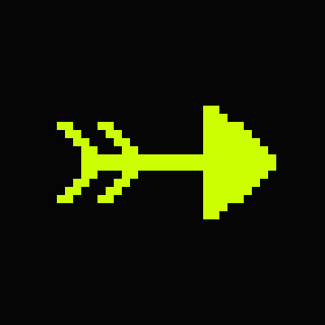
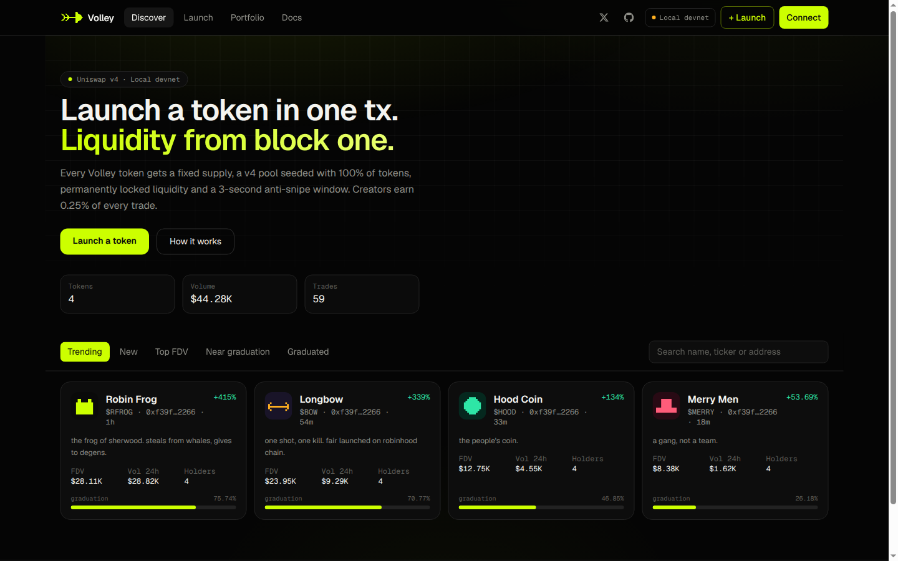
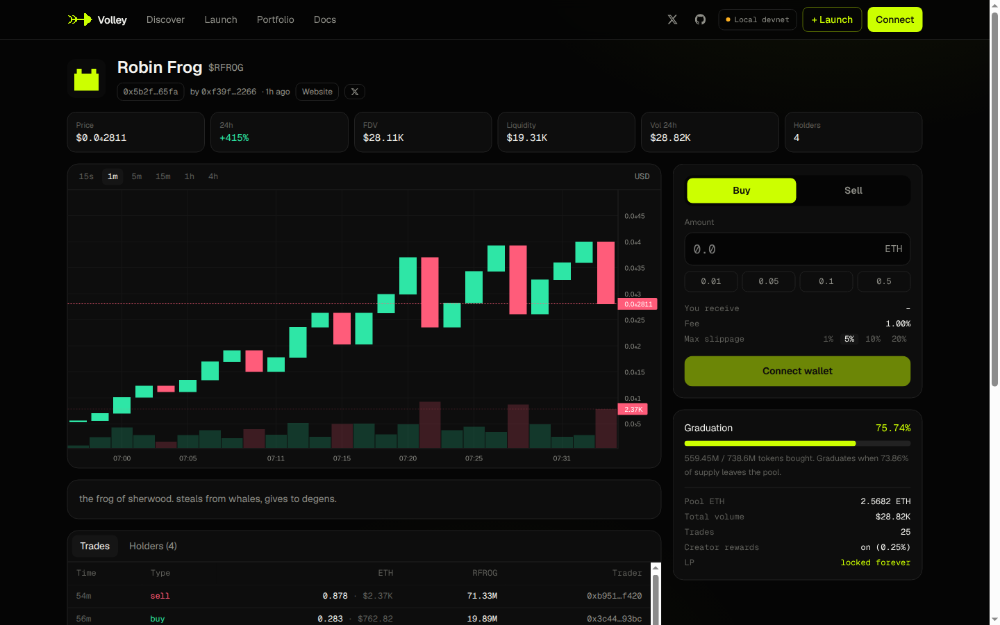
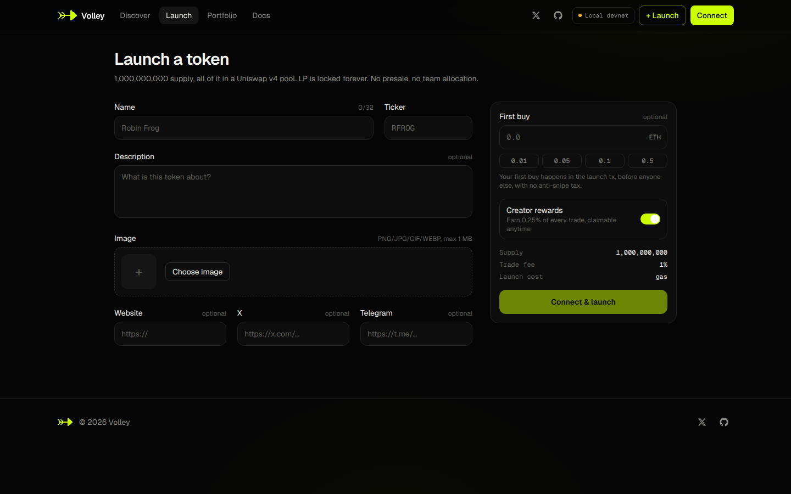
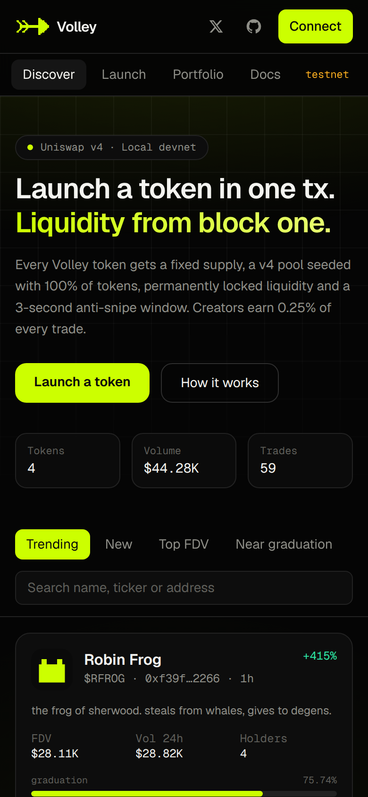
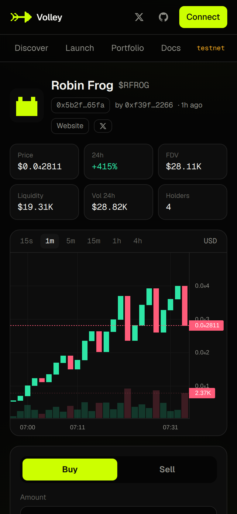
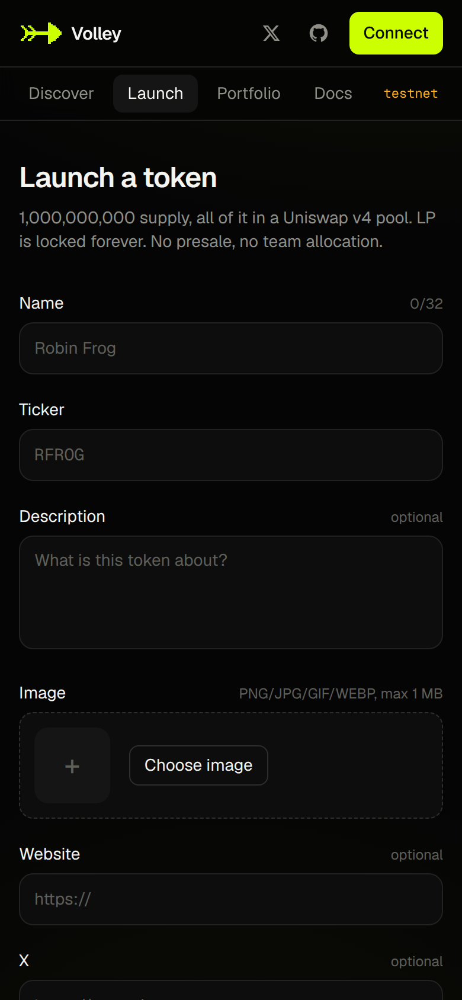

<p align="center">
  
</p>

<h1 align="center">Volley</h1>

<p align="center">
  Fair-launch token launchpad on <b>Robinhood Chain</b>, built on <b>Uniswap v4</b>.<br/>
  Launch a token in one tx. Liquidity from block one. LP locked forever.
</p>

<p align="center">
  <a href="https://volleyfun.org">volleyfun.org</a> ·
  <a href="https://x.com/_volleyFun">X</a> ·
  <a href="https://volleyfun.org/docs/">Docs</a>
</p>

<p align="center">
  
</p>

## How it works

- **One-tx launch**: the factory deploys a fixed-supply ERC-20 (1,000,000,000 tokens, no mint function), creates a native ETH / token Uniswap v4 pool and seeds it with 100% of the supply. No presale, no team allocation.
- **Locked liquidity**: the LP position is held by the factory contract, which has no function to remove it, so liquidity can never be pulled.
- **Creator first buy**: the creator can buy in the same launch tx, before anyone else and with no anti-snipe tax.
- **Anti-snipe window**: the first 3 seconds after launch carry a decaying tax that goes to the platform.
- **Fees**: every trade pays a small fee, split between the platform and (optionally) the creator. Creators claim their rewards any time.
- **Graduation**: a token graduates once 73.86% of the supply has been bought from the pool.

| Fee | Rate |
| --- | --- |
| Platform | 0.75% |
| Creator rewards (optional) | 0.25% |

| Seconds after launch | Anti-snipe tax |
| --- | --- |
| 0 | 99.00% |
| 1 | 24.81% |
| 2 | 5.19% |
| 3+ | 0% |

## Screenshots

<p align="center">
  
</p>

<p align="center">
  
</p>

<p align="center">
  
  
  
</p>

## Deployments

### Robinhood Chain testnet (chain id 46630)

| Contract | Address |
| --- | --- |
| LaunchFactory | [`0x6E9055a022BeC0F86cDcc5bD7AcB8A2847441d0E`](https://explorer.testnet.chain.robinhood.com/address/0x6E9055a022BeC0F86cDcc5bD7AcB8A2847441d0E) |
| LaunchHook | [`0xF44a38e9a6F1d6a160892beaB29455D7ef5ae8CC`](https://explorer.testnet.chain.robinhood.com/address/0xF44a38e9a6F1d6a160892beaB29455D7ef5ae8CC) |
| LaunchRouter | [`0xF4020916B173000A9FC0c3BcD06Cd1a2DEbEC3bA`](https://explorer.testnet.chain.robinhood.com/address/0xF4020916B173000A9FC0c3BcD06Cd1a2DEbEC3bA) |
| Uniswap v4 PoolManager | [`0x8366a39CC670B4001A1121B8F6A443A643e40951`](https://explorer.testnet.chain.robinhood.com/address/0x8366a39CC670B4001A1121B8F6A443A643e40951) |

Mainnet: not deployed yet. The contracts are unaudited.

## Architecture

```
contracts/   Solidity (Foundry): LaunchToken, LaunchFactory, LaunchHook (fees, anti-snipe,
             graduation), LaunchRouter (buy/sell/quotes on top of the v4 PoolManager)
api/         Cloudflare Worker + Durable Object (SQLite) indexer: launches, trades, holders,
             OHLC candles, rankings, portfolio, image/metadata uploads
web/         Next.js static frontend (wagmi + viem): discover, launch, token page with chart
             and trade panel, portfolio, docs
scripts/     local chain setup and smoke tests
```

## Development

Requirements: [Foundry](https://getfoundry.sh), Node.js 22+.

```bash
# contracts: tests run against a fork of Robinhood Chain testnet
cd contracts && forge test

# local stack: anvil + launchpad contracts, writes api/.dev.vars and web/.env.local
anvil --block-time 1
./scripts/local-chain.sh
./scripts/local-smoke.sh          # optional: launch a token and trade it

cd api && npm install && npm run dev    # indexer on :8787
cd web && npm install && npm run dev    # frontend on :3000
```

### Deploy

```bash
# contracts
cd contracts && forge script script/Deploy.s.sol \
  --rpc-url https://rpc.testnet.chain.robinhood.com --broadcast --slow --private-key <key>

# api: set FACTORY, HOOK and START_BLOCK in api/wrangler.jsonc
cd api && npx wrangler deploy

# web: static export to web/out, served from Cloudflare Pages
cd web && NEXT_PUBLIC_CHAIN_ID=46630 NEXT_PUBLIC_API_URL=https://api.volleyfun.org \
  NEXT_PUBLIC_FACTORY=... NEXT_PUBLIC_HOOK=... NEXT_PUBLIC_ROUTER=... npm run build
npx wrangler pages deploy out --project-name volley
```

